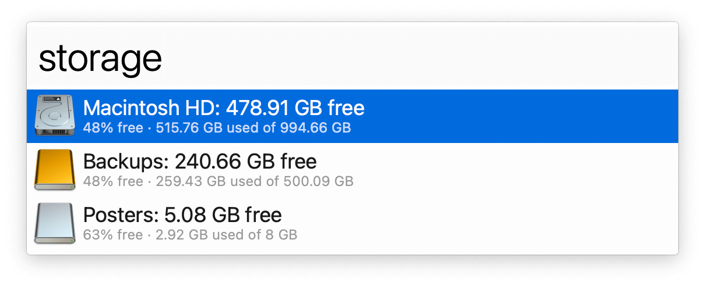

#  Disk Usage Alfred Workflow

See available disk space in all volumes

[⤓ Install on the Alfred Gallery](https://alfred.app/workflows/alfredapp/disk-usage)

## Usage

See how much storage is being used by internal and external disks via the `storage` keyword. Press <kbd>↩&#xFE0E;</kbd> to open a volume’s root folder in Finder.

